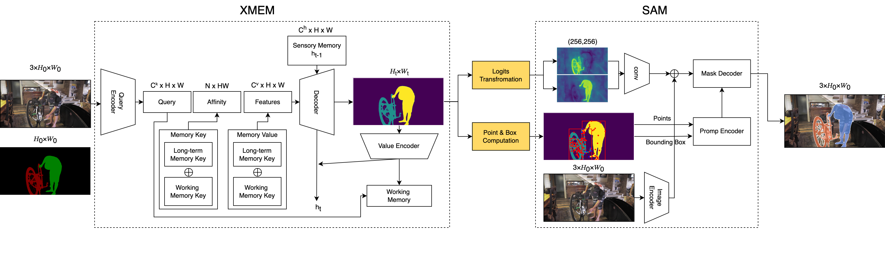
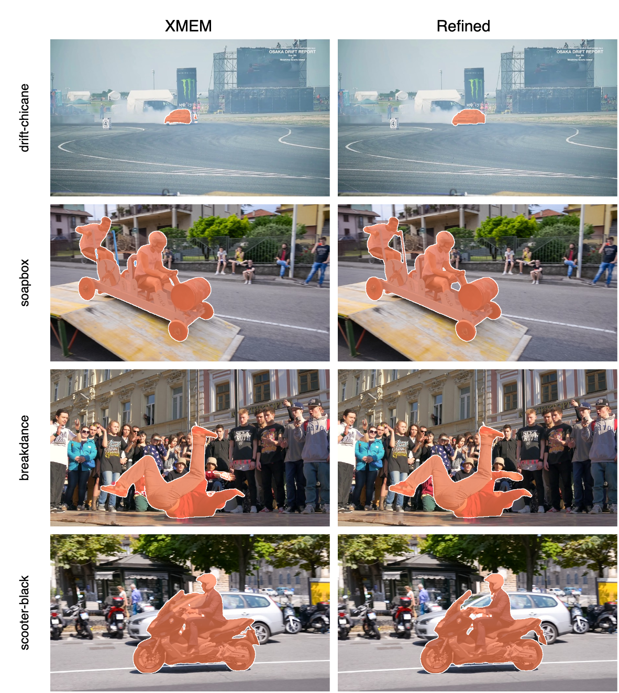
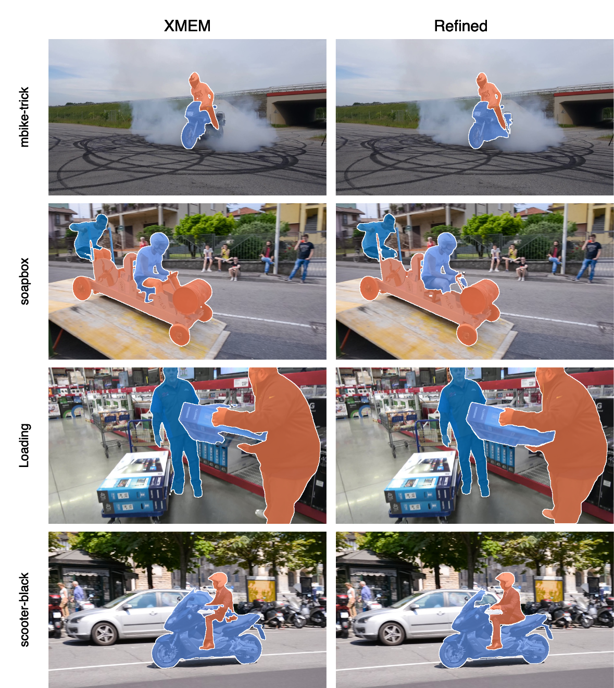
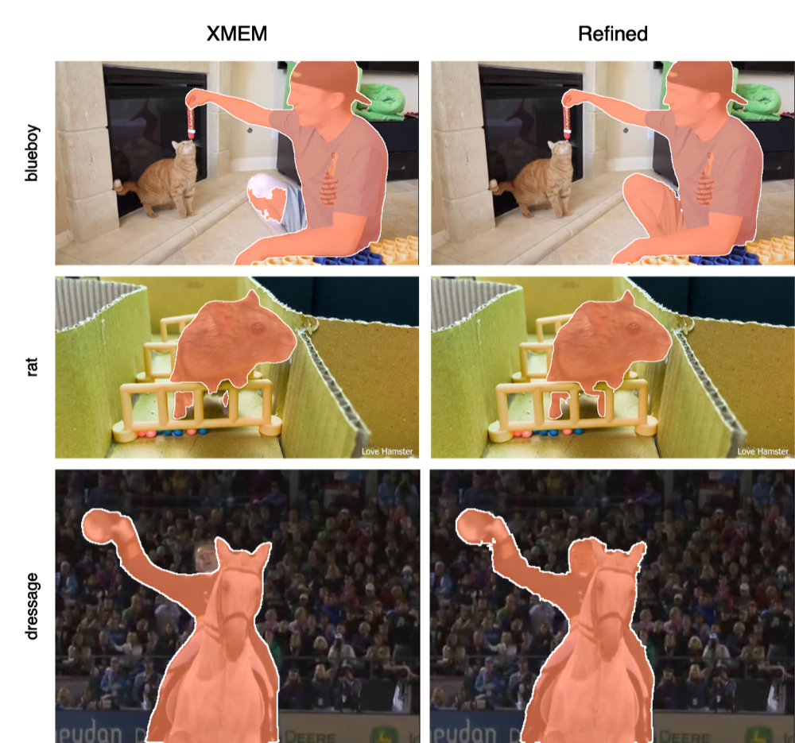

<!--  -->
<div style = "color: black;">
<div align=center>

</div>
<br/>
<div align=center>
<!-- <a src="https://img.shields.io/badge/%F0%9F%93%96-Arxiv_2304.11968-red.svg?style=flat-square" href="https://arxiv.org/abs/2304.11968">

</a> -->
</div>

<div style="padding: 15px;">
<h1>
VOS-E-SAM
</h1>

***Vanishing Mask Refinement in Semi-Supervised Video Object Segmentation*** 

This model unifies XMEM with SAM and SAM-HQ to enhance the performance of object segmentation. 


<h2>
Abstract
</h2>

This paper presents Video Object Segmentation Enhanced with Segment Anything Model (VOS/E-SAM), a multi-stage architecture for Semi-supervised Video Object Segmentation (SVOS) using the foundational Segment Anything Model (SAM) architecture, aimed at addressing the challenges of mask degradation over time in long video sequences. Our architectural approach enhances the object masks produced by the XMem model by incorporating SAM. This integra- tion uses various input combinations and low-level computer vision techniques to generate point prompts, in order to improve mask continuity and accuracy throughout the entire video cycle. The main challenge addressed is the fading or vanishing of object masks in long video sequences due to problems such as changes in object appearance, occlusions, camera movements, and approach changes. Both the baseline architecture and the newer high-quality version are tested, addressing the primary challenge of object mask fading or vanishing in long video sequences due to changes in object appearance, occlusions, camera movements, and variations in approach. Through rigorous experimentation with different prompt configurations, we identified an outstanding configuration of SAM inputs to improve mask refinement. Evaluations on benchmark long video datasets, such as LongDataset and LVOS, show that our approach significantly improves mask quality in single-object extended video sequences proven by percentage increments on jaccard index (J) and contour accuracy (F) based metrics (mean, recall and decay). Our results show remarkable improvements in mask persistence and accuracy, which sets a new standard for the integration of foundational models in video segmentation and lays the foundation for future research in this field

<h2>
Architecture
</h2>

<div align=center>

</div>

<!--  -->


## :rocket: Dataset Improvements 

***Davis 2016***

<div align=center >

</div>


<div align=center>
<br/>
<br/>
</div>

***Davis 2017***

<div align=center>

</div>

<div align=center>
<br/>
<br/>
</div>

***LongDataset***

<div align=center >

</div>


</div>

## :computer: How to use

### Get the enviroment ready
```shell
# Clone the repository:
gh repo clone jpitagc/VOS-E-SAM
cd Track-Anything

# Install dependencies: 
pip install -r requirements_SAM&HQSAM.txt
``` 
IMPORTANT 

Test for SAM and HQSAM are done using different virtual env and substituing the folder for package HQSAM.

HQSAM V1 is the one used. Could be found in this repo: [HQSAM Repo](https://github.com/SysCV/sam-hq)

Two different virtual environment should be created and changed whenever tests are shifted for SAM or HQSAM.
A selection in each example .ipynb has been added. 

Checkpoint form HQSAM to SAM and viceversa will fail in loading

```python
SAM_checkpoint = "./checkpoints/sam_vit_h_4b8939.pth"
if 'HQ' in sys.prefix.split('.')[-1]:SAM_checkpoint = "./checkpoints/sam_hq_vit_h.pth"
``` 
SAM venv should not add `HQ`  in the name. Example `.venvSAM` 

```shell
python -m venv .venvSAM
source .venvSAM/bin/activate
pip install -r requirements_SAM&HQSAM.txt

deactivate
``` 
HQSAM venv must add `HQ` in the name. Example `.venvHQSAM` 

```shell
python -m venv .venvHQSAM
source .venvHQSAM/bin/activate
pip install -r requirements_SAM&HQSAM.txt

deactivate
``` 
Substitute package Segment Anything  from original to HQ. 

```plaintext
1. Download repo https://github.com/SysCV/sam-hq
2. Find segment_anything folder in the repo 
3. Go to virtual env packages .venvHQSAM\Lib\site-packages\segment_anything
4. Replace folder
``` 


### Download checkpoints

```shell
# Creadte a checkpoints folder:
mkdir checkpoints
``` 
Segment Anything Checkpoint  -> [sam_vit_h_4b8939.pth](https://dl.fbaipublicfiles.com/segment_anything/sam_vit_h_4b8939.pth)

High Quality Segment Anything Checkpoint -> [sam_hq_vit_h.pth](https://drive.google.com/file/d/1qobFYrI4eyIANfBSmYcGuWRaSIXfMOQ8/view?usp=sharing)

XMem Checkpoint -> [XMem-s012.pth](https://drive.google.com/drive/folders/1QYsog7zNzcxGXTGBzEhMUg8QVJwZB6D1)

### Download datasets
```shell
# Create a datasets folder:
mkdir datasets
``` 
Davis 2016 [Download 480](https://graphics.ethz.ch/Downloads/Data/Davis/DAVIS-data.zip)

Davis 2017 [Download 480](https://data.vision.ee.ethz.ch/csergi/share/davis/DAVIS-2017-trainval-480p.zip)

```plaintext
DAVIS/
├── Annotation/
│   ├── 480p/
│   │   ├── bear/
│   │   └── .../
│   └── 1080p/
│       ├── bear/
│       └── .../
├── ImageSets/
│   ├── 2016/
│   │   ├── train
│   │   └── val
│   └── 2017/
│       ├── train
│       └── val
├── JPEGImages/
│   ├── 480p/
│   │   ├── bear/
│   │   └── .../
│   └── 1080p/
│       ├── bear/
│       └── .../
│
└── .../

``` 

LondVideo Dataset [Download](https://www.kaggle.com/datasets/gvclsu/long-videos?resource=download)


```plaintext
LongDataset/
├── Annotation/
│   ├── blueboy/
│   └── dressage/
│   └── rat/
│       
├── JPEGImages/
│   ├── blueboy/
│   └── dressage/
│   └── rat/
│
└── .../
``` 

LVOS Dataset [Download Test](https://drive.google.com/file/d/1Vp_y8dSUO4ktYmeBFkIQnmAxK6bl3Eyf/view)

```plaintext
LongVOS/
├── Test/
│   ├── Annotations/
│   │   ├── 5VwnMLaz/
│   │   └── .../
│   └── JPEGImages/
│       ├── 5VwnMLaz/
│       └── .../
├── Val/
│
└── .../
``` 

### Use python notebooks to start

Notebooks to run tests on each dataset are provided

All test runners will create a './results' folder or store in a existing one.

[DAVIS](./run_davis_test.ipynb)

[LongDataset](./run_longdataset_test.ipynb)

[LVOS](./run_lvos_test.ipynb)

### Test explanation

Three previous ipynb files tests are declared in the same way. 

Here is an explanation of each

DAVIS
```python
# Create a datasets folder:
{
    'DatasetArgs' :{
        'Dataset' : 'Davis', # Dataset to load for test
        'Year' : 17, # Year of the dataset 17 or 16
        'Set' : 'val', # Set inside the dataset to use train or val
        'Resolution': '480p' # Resolition to work with 480p or 1080p
    },
    'TrackingAnythingArgs' : {
            'use_refinement' : True, # If SAM or HQ SAM Refinement is needed. True or False. False is XMEM default architecture
            'refinement_mode' : 'both_neg', # Which prompt inputs to use for SAM models. Posibilities ['point','bbox','both','both_neg','mask','mask_bbox','mask_pos','mask_bbox_pos_neg','mask_bbox_neg','mask_bbox_pos']
            'addArgs1':'CP', # Points calculations. Posibilities  ['C','CP','CPS'] 
            'optimized':False, # Wheter expected IoU from SAM or HQSAM is used to determined if masks is better. True or False
    }
}
``` 

DAVIS
```python
runtimeargs = {
    'DatasetArgs' :{
        'Dataset' : 'LongDataset', # Dataset to load for test
        'Set' : 'val', # Set inside the dataset to use
    },
    'TrackingAnythingArgs' : {
            'use_refinement' : True, # If SAM or HQ SAM Refinement is needed. True or False. False is XMEM default architecture
            'refinement_mode' : 'both_neg', # Which prompt inputs to use for SAM models. Posibilities ['point','bbox','both','both_neg','mask','mask_bbox','mask_pos','mask_bbox_pos_neg','mask_bbox_neg','mask_bbox_pos']
            'addArgs1':'CP', # Points calculations. Posibilities  ['C','CP','CPS'] 
            'optimized':False, # Wheter expected IoU from SAM or HQSAM is used to determined if masks is better. True or False
    }
}
``` 

DAVIS
```python
{
    'DatasetArgs' :{
        'Dataset' : 'LongVOS', # Dataset to load for test
        'Set' : 'test', # Set inside the dataset to use
    },
      'TrackingAnythingArgs' : {
            'use_refinement' : False, # If SAM or HQ SAM Refinement is needed. True or False. False is XMEM default architecture
            'refinement_mode' : 'both_neg', # Which prompt inputs to use for SAM models. Posibilities ['point','bbox','both','both_neg','mask','mask_bbox','mask_pos','mask_bbox_pos_neg','mask_bbox_neg','mask_bbox_pos']
            'addArgs1':'CP', # Points calculations. Posibilities  ['C','CP','CPS'] 
            'optimized':False, # Wheter expected IoU from SAM or HQSAM is used to determined if masks is better. True or False
    }
}
``` 
## :book: Citation

If you find this project useful in your research, please consider citing:

```bibtex
@article{PITA2025112837,
  title = {Vanishing mask refinement in semi-supervised video object segmentation},
  journal = {Applied Soft Computing},
  pages = {112837},
  year = {2025},
  issn = {1568-4946},
  doi = {https://doi.org/10.1016/j.asoc.2025.112837},
  url = {https://www.sciencedirect.com/science/article/pii/S1568494625001486},
  author = {Javier Pita and Juan P. Llerena and Miguel A. Patricio and Antonio Berlanga and Luis Usero},
  keywords = {Video Object Segmentation, Foundation model, Object Segmentation, Long-term videos, Deep learning}
}
```

## :clap: Acknowledgements

The project is based on the code of [Track Anything](https://github.com/gaomingqi/Track-Anything) and uses 
[XMem](https://github.com/hkchengrex/XMem), [Segment Anything](https://github.com/facebookresearch/segment-anything), and [Segment Anything in High Quality](https://github.com/SysCV/sam-hq). Thanks for the authors for their efforts.

</div>
